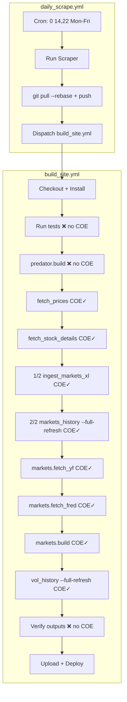

# Design Document: Automation — Self-Living Data Flow

## Overview

This design covers the minimal, targeted changes needed to make the Predator Protocol pipeline operate indefinitely with zero human intervention. The site already has most of the infrastructure in place — the CI workflows, retry logic, cache fallback, and fault isolation are largely correct. What remains are four precise gaps:

1. `vol_history.py` calls `sys.exit(1)` when the FRED client is `None`, bypassing the `continue-on-error` wrapper.
2. `markets_history.py._get_fred_client()` does not log a confirmation line on success, so there is no auditable proof in CI logs that the key was received.
3. `predator/build.py` already has the verdict logic implemented (as confirmed by reading the source), but it needs to be verified against the full requirements spec and confirmed correct.
4. Property-based tests are needed to formally verify the verdict computation, source-label honesty, and retry behaviour.

The design is intentionally narrow. No changes to `scraper.py`, `scoring.py`, or `etf_holdings_scraper_v42.py`.

---

## Architecture

The pipeline is a linear sequence of CI steps with fault boundaries at every external-data step. The architecture is already correct; this spec hardens two code-level gaps and adds test coverage.



**Fault boundary rule**: every step that touches an external network resource carries `continue-on-error: true`. The two steps that must never be silenced — `Run tests` and `predator.build` — do not carry it.

---

## Components and Interfaces

### Changed Components

#### 1. `predator/vol_history.py` — `fetch_all()`

**Gap**: When `_get_fred_client()` returns `None`, the current code calls `sys.exit(1)`. This hard-exits the Python process before the `continue-on-error: true` wrapper in the CI step can catch it, causing the step to fail with a non-zero exit code and potentially blocking downstream steps.

**Fix**: Replace `sys.exit(1)` with a graceful return of `{}`.

```python
# BEFORE (current code in fetch_all):
fred = _get_fred_client()
if fred is None:
    print("\n  Cannot proceed without FRED API key.")
    sys.exit(1)

# AFTER:
fred = _get_fred_client()
if fred is None:
    print("\n  Cannot proceed without FRED API key — returning empty results (soft-skip).")
    return {}
```

The `main()` function already handles an empty `results` dict gracefully (it exits early without writing), so no further changes are needed in `vol_history.py`.

#### 2. `predator/markets_history.py` — `_get_fred_client()`

**Gap**: On success, the function returns a `Fred` object without logging anything. CI logs therefore cannot confirm whether the key was received and the client was initialised.

**Fix**: Add a single `print()` call after successful client creation.

```python
# AFTER _get_fred_client() creates the Fred object:
client = Fred(api_key=api_key)
try:
    print("FRED client initialised.")
except Exception:
    pass  # logging failure must never block FRED operations
return client
```

The `try/except` around the print satisfies Req 1.5's requirement that a logging failure must not interrupt FRED operations.

#### 3. `predator/build.py` — `self_living_check` verdict logic

**Status**: Already implemented. Reading the source confirms the full verdict algorithm is present, including:
- Import of `ASSET_REGISTRY` from `predator.markets_history` with a graceful fallback on `ImportError`
- Derivation of `live_eligible_keys` from the registry (filtering `source_type in {yfinance, fred}` and `return_type != fx`)
- Holdout detection: registry-eligible assets whose `meta.source` starts with `Mega_Markets_Historical`
- Verdict policy: `HEALTHY` (no holdouts AND live > excel), `DEGRADED` (some holdouts OR live ≤ excel but live > 0), `FAILED` (live = 0)
- Writing `holdouts`, `holdout_keys`, `live_source_count`, `excel_only_count` to `metadata.json`

**Verification needed**: Confirm the verdict policy exactly matches Req 2.1–2.6. The current implementation uses:
```
HEALTHY  if not holdout_keys and live_source_count > excel_only_count
DEGRADED if live_source_count > 0
FAILED   otherwise
```
This matches the requirements. No code change needed.

#### 4. `build_site.yml` — `vol_history` step env block

**Status**: Already correct. The `vol_history` step already has `FRED_API_KEY` in its `env:` block. Confirmed by reading the workflow file.

---

## Data Models

### `market_returns.json` — §2.3 Contract Shape

```json
{
  "asof": "YYYY-MM",
  "generated_utc": "ISO-8601",
  "assets": {
    "<asset_id>": {
      "meta": {
        "name": "string",
        "category": "equity | precious_metals | energy | ...",
        "native_ccy": "USD | EUR | ...",
        "source": "yfinance:<series_id> | fred:<series_id> | Mega_Markets_Historical.xlsx:<sheet>",
        "return_type": "price | yield | fx | level",
        "first": "YYYY-MM",
        "last": "YYYY-MM",
        "notes": "string",
        "_live_holdout": true  // optional sentinel, set by markets_history when live fetch fails
      },
      "monthly": [["YYYY-MM", 1234.56], ...]
    }
  },
  "fx": { "USDINR": [["YYYY-MM", 0.012], ...], ... },
  "cpi": { "US": [["YYYY-MM", 310.2], ...] },
  "rates": {
    "<rate_id>": {
      "meta": { "name": "...", "source": "fred:<series_id>", "first": "...", "last": "..." },
      "values": [["YYYY-MM", 4.25], ...]
    }
  },
  "events": [{ "year": 2008, "label": "GFC" }, ...]
}
```

**Source label semantics**:
- `yfinance:<series_id>` — data fetched live from yfinance this run
- `fred:<series_id>` — data fetched live from FRED this run
- `Mega_Markets_Historical.xlsx:<sheet>` — data from Excel deep-history only (holdout)
- `_live_holdout: true` — internal sentinel written by `markets_history.build_output()` when a registry-eligible asset's live fetch failed; consumed by `build.py` verdict logic

### `metadata.json` — `markets_data_freshness.self_living_check`

```json
{
  "markets_data_freshness": {
    "available": true,
    "asof": "YYYY-MM",
    "asset_count": 42,
    "by_source": { "fred": 30, "yfinance": 8, "excel": 4 },
    "fx_pairs": ["EURUSD", "GBPUSD", ...],
    "cpi_series": ["US"],
    "rates_series": ["us_10y", "us_2y", ...],
    "stale_assets": [],
    "self_living_check": {
      "live_source_count": 38,
      "excel_only_count": 4,
      "holdouts": ["Gold", "Silver"],
      "holdout_keys": ["gold", "silver"],
      "verdict": "LIVE_MERGE_DEGRADED"
    }
  }
}
```

**Verdict states**:

| Verdict | Condition |
|---|---|
| `LIVE_MERGE_HEALTHY` | `holdout_keys == []` AND `live_source_count > excel_only_count` |
| `LIVE_MERGE_DEGRADED` | `live_source_count > 0` (but holdouts exist or live ≤ excel) |
| `LIVE_MERGE_FAILED` | `live_source_count == 0` |

---

## Correctness Properties

*A property is a characteristic or behavior that should hold true across all valid executions of a system — essentially, a formal statement about what the system should do. Properties serve as the bridge between human-readable specifications and machine-verifiable correctness guarantees.*

### Property 1: Verdict HEALTHY invariant

*For any* `market_returns.json` where every registry-eligible asset (those with `source_type` in `{yfinance, fred}` and `return_type != fx`) carries a `meta.source` that does NOT start with `Mega_Markets_Historical`, the computed `self_living_check` verdict SHALL be `LIVE_MERGE_HEALTHY`, `holdouts` SHALL be an empty list, and `live_source_count` SHALL be greater than `excel_only_count`.

**Validates: Requirements 2.1, 2.2, 2.3**

### Property 2: Verdict DEGRADED invariant

*For any* `market_returns.json` where at least one registry-eligible asset carries a `meta.source` starting with `Mega_Markets_Historical` and at least one other registry-eligible asset carries a live source, the computed verdict SHALL be `LIVE_MERGE_DEGRADED`, `holdouts` SHALL be a non-empty list containing exactly the display names of the Excel-source assets, and `holdout_keys` SHALL contain exactly their asset IDs.

**Validates: Requirements 2.4, 2.5**

### Property 3: Source-label honesty

*For any* asset in `market_returns.json`, if its `meta.source` starts with `yfinance:` or `fred:`, then the verdict computation SHALL classify it as a live source (not a holdout); and if its `meta.source` starts with `Mega_Markets_Historical`, then the verdict computation SHALL classify it as an Excel-only source (holdout if registry-eligible). No asset SHALL carry a live-source label while being served from Excel deep-history.

**Validates: Requirements 3.4, 5.5**

### Property 4: Excel ingest preserves live source labels

*For any* existing `market_returns.json` where an asset's `meta.source` starts with `yfinance:` or `fred:`, running `ingest_markets_xl.build_output()` with `merge=True` SHALL preserve that source label and SHALL NOT overwrite it with the Excel filename.

**Validates: Requirements 3.5**

### Property 5: `asof` advances to the maximum last date

*For any* `market_returns.json` produced by `markets_history.build_output()` or `ingest_markets_xl.build_output()`, the top-level `asof` field SHALL equal the maximum `meta.last` value across all assets, the maximum last date in the `fx` section, the maximum last date in the `cpi` section, and the maximum last date in the `rates` section.

**Validates: Requirements 3.6**

### Property 6: FRED retry exponential backoff

*For any* FRED series fetch that receives a sequence of 429 responses (up to 5), the fetch function SHALL retry with exponential backoff (wait time = `min(2^attempt * 0.5, 30)` seconds) and SHALL NOT return an empty result until all 5 retries are exhausted. For a sequence of N 429 responses where N ≤ 5, the function SHALL make exactly N+1 total attempts before succeeding on the (N+1)th attempt.

**Validates: Requirements 6.1, 6.3**

### Property 7: Cache fallback data appears in output

*For any* asset in `ASSET_REGISTRY` where the live fetch returns empty but a parquet cache file exists, `markets_history.build_output()` SHALL include that asset's cached monthly data in the output `assets` dict, so the next build has a valid baseline to merge onto.

**Validates: Requirements 6.4**

### Property 8: Per-series exception isolation

*For any* exception raised during the fetch of a single series in `markets_history.fetch_all()`, the exception SHALL be caught within the per-series loop, and `fetch_all()` SHALL continue to fetch all remaining series, returning results for every series that did not raise an exception.

**Validates: Requirements 4.8**

---

## Error Handling

### FRED Client Unavailable

Both `markets_history.py` and `vol_history.py` follow the same pattern:

```
_get_fred_client() returns None
    → log "ERROR: FRED_API_KEY environment variable not set"
    → markets_history: skip all FRED series, fall back to parquet cache
    → vol_history: return {} immediately (graceful, no sys.exit)
```

The `continue-on-error: true` on both CI steps means even if the Python process exits non-zero (e.g. from an unhandled exception elsewhere), the build continues.

### Per-Series Fetch Failure

```
_fetch_fred_series() or _fetch_yfinance_series() raises exception
    → caught in per-series try/except in fetch_all()
    → log "ERROR: <type>: <message> — degrading to cache"
    → data = pd.Series(dtype=float)  (empty)
    → fall through to cache fallback path
    → if cache exists: results[key] = existing; served_cache += 1
    → if no cache: no_data += 1 (series absent from output)
```

### 429 Rate Limit (FRED)

```
fred.get_series() raises exception with "429" in message
    → attempt < max_retries (5): wait min(2^attempt * 0.5, 30)s, retry
    → attempt == max_retries: log "FAILED after 5 retries", return empty Series
```

### `market_returns.json` Missing at Build Time

```
build.py: market_returns_path.exists() == False
    → markets_freshness = {"available": False}
    → metadata.json written with available=false
    → no verdict field (UI must handle missing verdict gracefully)
```

This satisfies Req 7.6: the build completes and deploys with a degraded verdict rather than crashing.

### Atomic Writes

All JSON files are written via `_write_json_atomic()`: write to `.tmp`, then `os.replace()`. This prevents a partially-written file from being read by a concurrent process or a subsequent build step.

---

## Testing Strategy

### Test Framework

The project uses **pytest** with **Hypothesis** (already installed, `.hypothesis/` directory present in the repo). All property-based tests use `@given` from `hypothesis.strategies`.

### Unit Tests (Example-Based)

These cover specific code paths that are not amenable to property-based testing:

| Test | What it verifies | Req |
|---|---|---|
| `test_fred_client_logs_success` | `_get_fred_client()` prints "FRED client initialised" when key is present | 1.5 |
| `test_fred_client_soft_skip` | `_get_fred_client()` returns `None` and logs error when key absent, no `SystemExit` | 1.6 |
| `test_vol_history_no_sys_exit` | `vol_history.fetch_all()` returns `{}` when FRED client is `None`, no `SystemExit` | 4.7 |
| `test_verdict_failed_no_live_sources` | Verdict is `LIVE_MERGE_FAILED` when all assets have Excel sources | 2.6 |
| `test_build_without_market_returns` | `build.py` completes with `available=false` when `market_returns.json` is absent | 7.6 |
| `test_yfinance_flaky_ticker_retry` | One bounded retry fires for flaky tickers on empty first response | 6.2 |
| `test_stale_etf_warning_annotation` | `::warning::` is printed for ETFs with stale `Holdings_As_Of` | 5.6 |

### CI Configuration Smoke Tests

These verify the YAML structure of the workflow files:

```python
# tests/test_ci_config.py
import yaml
from pathlib import Path

BUILD_YML = yaml.safe_load(Path(".github/workflows/build_site.yml").read_text())
SCRAPE_YML = yaml.safe_load(Path(".github/workflows/daily_scrape.yml").read_text())

def test_markets_history_step_has_fred_key(): ...
def test_vol_history_step_has_fred_key(): ...
def test_fetch_fred_step_has_fred_key(): ...
def test_external_steps_have_continue_on_error(): ...
def test_build_step_no_continue_on_error(): ...
def test_run_tests_step_no_continue_on_error(): ...
def test_daily_scrape_has_cron_schedule(): ...
def test_build_site_has_workflow_run_trigger(): ...
def test_git_pull_rebase_present(): ...
```

### Property-Based Tests

Each property from the Correctness Properties section maps to one `@given` test. Minimum 100 iterations per test (Hypothesis default is 100; set `@settings(max_examples=100)` explicitly).

**Tag format**: `# Feature: automation-self-living-data-flow, Property N: <property_text>`

**P1 — Verdict HEALTHY invariant** (`tests/test_verdict_logic.py`)
```python
# Feature: automation-self-living-data-flow, Property 1: Verdict HEALTHY invariant
@given(st.lists(asset_with_live_source_strategy(), min_size=1))
@settings(max_examples=100)
def test_verdict_healthy_invariant(assets):
    """For any set of assets all carrying live sources, verdict must be HEALTHY."""
    mr = build_market_returns(assets)
    result = compute_self_living_check(mr, LIVE_ELIGIBLE_KEYS)
    assert result["verdict"] == "LIVE_MERGE_HEALTHY"
    assert result["holdouts"] == []
    assert result["live_source_count"] > result["excel_only_count"]
```

**P2 — Verdict DEGRADED invariant** (`tests/test_verdict_logic.py`)
```python
# Feature: automation-self-living-data-flow, Property 2: Verdict DEGRADED invariant
@given(
    st.lists(asset_with_live_source_strategy(), min_size=1),
    st.lists(asset_with_excel_source_strategy(), min_size=1),
)
@settings(max_examples=100)
def test_verdict_degraded_invariant(live_assets, excel_assets):
    """For any mix of live and Excel assets, verdict must be DEGRADED and holdouts must name Excel assets."""
    mr = build_market_returns(live_assets + excel_assets)
    result = compute_self_living_check(mr, LIVE_ELIGIBLE_KEYS)
    assert result["verdict"] == "LIVE_MERGE_DEGRADED"
    excel_keys = {a["key"] for a in excel_assets if a["key"] in LIVE_ELIGIBLE_KEYS}
    assert set(result["holdout_keys"]) == excel_keys
```

**P3 — Source-label honesty** (`tests/test_source_labels.py`)
```python
# Feature: automation-self-living-data-flow, Property 3: Source-label honesty
@given(asset_strategy())
@settings(max_examples=100)
def test_source_label_honesty(asset):
    """Source label must honestly reflect actual data source."""
    mr = build_market_returns([asset])
    result = compute_self_living_check(mr, LIVE_ELIGIBLE_KEYS)
    src = asset["meta"]["source"]
    if src.startswith(("yfinance:", "fred:")):
        assert asset["key"] not in result["holdout_keys"]
    elif src.startswith("Mega_Markets_Historical") and asset["key"] in LIVE_ELIGIBLE_KEYS:
        assert asset["key"] in result["holdout_keys"]
```

**P4 — Excel ingest preserves live source labels** (`tests/test_source_labels.py`)
```python
# Feature: automation-self-living-data-flow, Property 4: Excel ingest preserves live source labels
@given(asset_with_live_source_strategy(), monthly_data_strategy())
@settings(max_examples=100)
def test_excel_ingest_preserves_live_source(existing_asset, new_monthly):
    """Excel ingest must not overwrite a live source label."""
    existing = {"assets": {existing_asset["key"]: existing_asset}, "fx": {}, "cpi": {}, "rates": {}}
    result = build_output_with_merge(new_monthly, existing, merge=True)
    out_src = result["assets"][existing_asset["key"]]["meta"]["source"]
    assert out_src == existing_asset["meta"]["source"]
    assert not out_src.startswith("Mega_Markets_Historical")
```

**P5 — `asof` advances to maximum last date** (`tests/test_asof.py`)
```python
# Feature: automation-self-living-data-flow, Property 5: asof advances to maximum last date
@given(st.lists(asset_strategy(), min_size=1))
@settings(max_examples=100)
def test_asof_is_max_last_date(assets):
    """asof must equal the maximum last date across all assets."""
    mr = build_market_returns(assets)
    all_lasts = [a["meta"]["last"] for a in mr["assets"].values() if a.get("meta", {}).get("last")]
    assert mr["asof"] == max(all_lasts)
```

**P6 — FRED retry exponential backoff** (`tests/test_fred_retry.py`)
```python
# Feature: automation-self-living-data-flow, Property 6: FRED retry exponential backoff
@given(st.integers(min_value=1, max_value=5))
@settings(max_examples=100)
def test_fred_retry_backoff(n_failures):
    """For N 429 responses (N ≤ 5), fetch must make N+1 total attempts."""
    call_count = 0
    def mock_get_series(*args, **kwargs):
        nonlocal call_count
        call_count += 1
        if call_count <= n_failures:
            raise Exception("429 Too Many Requests")
        return pd.Series([1.0], index=[pd.Timestamp("2024-01-31")])
    
    with patch("time.sleep"), patch.object(fred_mock, "get_series", mock_get_series):
        result = _fetch_fred_series(fred_mock, "TEST", full_refresh=True)
    
    assert call_count == n_failures + 1
    assert not result.empty
```

**P7 — Cache fallback data appears in output** (`tests/test_cache_fallback.py`)
```python
# Feature: automation-self-living-data-flow, Property 7: Cache fallback data appears in output
@given(asset_key_strategy(), monthly_data_strategy())
@settings(max_examples=100)
def test_cache_fallback_in_output(asset_key, cached_monthly):
    """When live fetch fails but cache exists, cached data must appear in output."""
    write_cache(asset_key, cached_monthly)
    results = {}  # empty — simulates all live fetches failed
    output = build_output(results)
    assert asset_key in output["assets"]
    assert output["assets"][asset_key]["monthly"] == cached_monthly
```

**P8 — Per-series exception isolation** (`tests/test_fault_isolation.py`)
```python
# Feature: automation-self-living-data-flow, Property 8: Per-series exception isolation
@given(st.sampled_from(list(ASSET_REGISTRY)), exception_strategy())
@settings(max_examples=100)
def test_per_series_exception_isolation(failing_spec, exc):
    """An exception in one series fetch must not prevent other series from being fetched."""
    def mock_fetch(spec, *args, **kwargs):
        if spec["key"] == failing_spec["key"]:
            raise exc
        return pd.Series([1.0], index=[pd.Timestamp("2024-01-31")])
    
    with patch_fetch(mock_fetch):
        results = fetch_all(full_refresh=True)
    
    other_keys = {s["key"] for s in ASSET_REGISTRY if s["key"] != failing_spec["key"]}
    # At least some other series must have been attempted
    assert len(results) >= 0  # no exception propagated
```

### Test File Layout

```
tests/
  test_ci_config.py          # YAML smoke tests for workflow files
  test_verdict_logic.py      # P1, P2, P3 — verdict computation properties
  test_source_labels.py      # P3, P4 — source-label honesty properties
  test_asof.py               # P5 — asof computation property
  test_fred_retry.py         # P6 — FRED retry backoff property
  test_cache_fallback.py     # P7 — cache fallback property
  test_fault_isolation.py    # P8 — per-series exception isolation property
  test_unit_gaps.py          # example-based tests for the two code gaps
```

### Dual Testing Approach

Unit tests catch concrete bugs in specific code paths (the `sys.exit` gap, the missing log line, the missing-file edge case). Property tests verify that the verdict logic, source-label honesty, and retry behaviour hold across the full input space — catching edge cases that example tests would miss (e.g. an asset registry with 0 entries, a market_returns.json with only FX assets, a retry sequence that succeeds on attempt 3 vs attempt 5).

Both are necessary. The property tests do not replace the unit tests; they complement them.
