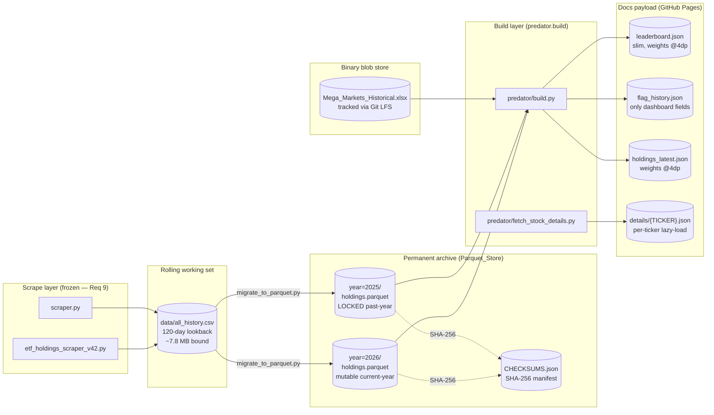
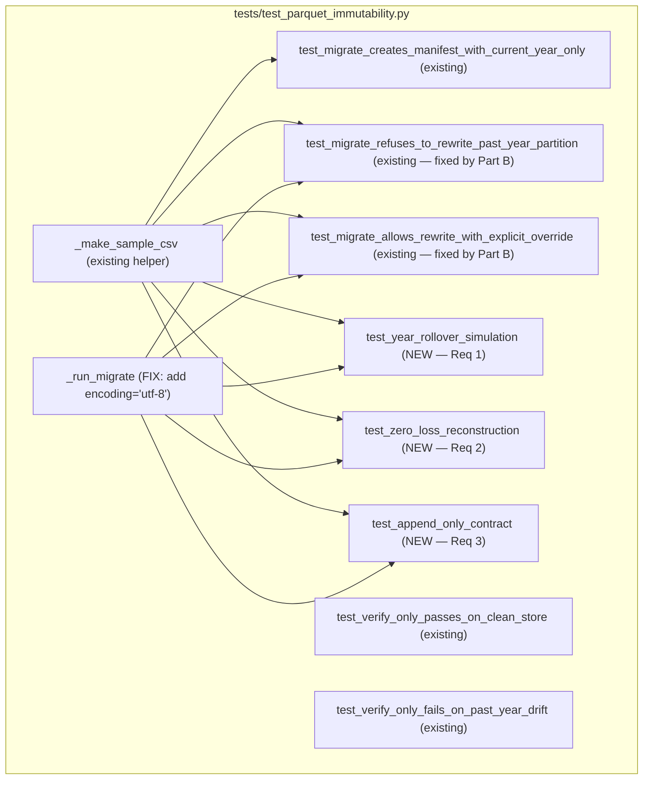

# Design Document

## Overview

This spec hardens the storage contract of the Predator Protocol ETF data repository so that the archive remains **bounded in committed size**, **provably zero-loss in historical holdings data**, and **sustainable at a 5-year horizon**. The work is decomposed into four parts that share one architectural backbone (the year-partitioned Parquet store guarded by `scripts/migrate_to_parquet.py`):

- **Part A — Year-Rollover Proof**: three new `tmp_path` sandbox tests in `tests/test_parquet_immutability.py` that exercise the immutability guard across a synthetic year boundary, prove zero-loss reconstruction from Parquet alone, and machine-verify the Append_Only_Contract.
- **Part B — Subprocess Encoding Fix**: a one-line change to the `_run_migrate` helper in `tests/test_parquet_immutability.py` (`encoding="utf-8"` keyword) so the existing two failing tests pass on Windows where `cp1252` cannot decode the migrate script's UTF-8 emoji.
- **Part C — Bounded Footprint**: migrate `Mega_Markets_Historical.xlsx` (10.62 MB) to Git LFS via `.gitattributes` plus `git lfs migrate import`, and reduce the committed `docs/data/` payload by **rounding numeric precision** and **dropping unreferenced fields** in `holdings_latest.json` (3.38 MB → 2.90 MB measured post-implementation). `flag_history.json` and `leaderboard.json` are bounded by the key-allowlist and zero-vs-omission rules but their absolute sizes grow organically with the ticker universe and historical snapshot count — never by removing semantic data the dashboard consumes.
- **Part D — 5-Year Growth Projection**: a documented projection demonstrating that at the measured ingestion rate (~1,107 rows/day, ~6.2 bytes/row Parquet), the 5-year repository footprint stays around 32 MB — well within GitHub's 1 GB soft limit.

The spec is intentionally **complementary** to `automation-self-living-data-flow` (which covers pipeline resilience: scrape failures, partial-year rebuilds, live-merge correctness). This spec is exclusively concerned with the **storage contract** — the byte-level invariants of the Parquet_Store, the test coverage that proves them, and the size discipline that keeps the repository clonable forever.

### Sacred guards (pulled forward from Requirement 9)

The following are out-of-scope and MUST NOT be touched by any task in this spec:

- `scraper.py`, `scripts/etf_holdings_scraper_v42.py` — scraper logic frozen
- `predator/scoring.py` — scoring math frozen
- The `Dedup_Key` `(ETF_Ticker, ticker, Holdings_As_Of)` with `keep="last"` tie-break inside `migrate_to_parquet.py` — frozen
- The Append_Only_Contract — no size-bounding mechanism in this spec is allowed to drop historical rows; bounding is achieved via Parquet compression, JSON precision rounding, and Git LFS for binary blobs only.

## Architecture

The architecture has not changed; this spec instead **proves** that the existing architecture honors its contract and **bounds** the parts of it that grow. The diagram below labels each storage tier with its mutability status and the test that pins it.



### Mutability classification

| Tier | Mutability | Pinned by |
|------|------------|-----------|
| `data/history_parquet/year=YYYY/holdings.parquet` (year < current_year) | **Immutable** (byte-frozen by manifest SHA-256) | `test_past_year_partitions_are_immutable`, new `test_year_rollover_simulation`, new `test_append_only_contract` |
| `data/history_parquet/year=YYYY/holdings.parquet` (year == current_year) | Mutable; grows daily | new `test_append_only_contract` (row-count growth) |
| `data/history_parquet/CHECKSUMS.json` | Updated on every migrate write | `test_manifest_well_formed`, `test_manifest_partitions_reflect_disk` |
| `data/all_history.csv` | Mutable rolling window (120-day) | bounded by lookback policy (Req 8.5) |
| `docs/data/*.json` | Rebuilt every CI run from Parquet_Store + scraper output | `predator.build` deterministic outputs |
| `Mega_Markets_Historical.xlsx` | Updated occasionally | tracked via Git LFS |

### Where the new tests sit

The three new tests in **Part A** all live in `tests/test_parquet_immutability.py` (the same file that already pins the manifest schema). They use the existing `_make_sample_csv` and `_run_migrate` helpers; they all use `tmp_path` to avoid touching the real `data/history_parquet/` store.



## Components and Interfaces

### Part A — Year-Rollover Proof Tests

All three new tests reuse the existing helpers and add no new fixtures. Their interfaces are:

```python
def test_year_rollover_simulation(tmp_path: Path) -> None:
    """
    Step 1: write CSV with only year=2026 rows; run migrate.
    Step 2: record SHA-256 and byte size of year=2026/holdings.parquet.
    Step 3: write CSV with year=2026 + year=2027 rows; run migrate again.
    Step 4: assert SHA-256 and byte size of year=2026/holdings.parquet are unchanged.
    Step 5: assert "LOCKED" appears in stdout for year=2026.
    Step 6: assert year=2027/holdings.parquet was created.
    """

def test_zero_loss_reconstruction(tmp_path: Path) -> None:
    """
    Step 1: write multi-year CSV (year=2025: 5 rows, year=2026: 7 rows; minimum).
    Step 2: run migrate.
    Step 3: read both partition files; concat into a single DataFrame.
    Step 4: dedup both source and reconstructed on (ETF_Ticker, ticker, Holdings_As_Of).
    Step 5: assert deduplicated row counts are equal.
    Step 6: assert every Dedup_Key in source is present in reconstructed (set equality).
    Step 7: fail loudly if either dataset is empty.
    """

def test_append_only_contract(tmp_path: Path) -> None:
    """
    Step 1: bootstrap with past-year rows; assert partition + manifest record exist.
    Step 2: record past-year SHA-256, byte size, row count, and manifest entry.
    Step 3: append CURRENT-YEAR rows; re-run migrate.
    Step 4: assert past-year SHA-256 unchanged AND past-year row count unchanged
            (two independent checks — distinguishes a mutation from a check failure).
    Step 5: assert manifest 'generated_at' advanced.
    Step 6: assert current-year partition row count grew by net-new Dedup_Keys.
    Step 7: assert no file under PARQUET_STORE (real path) was read or written.
    """
```

The fixed-year choice (`2026` and `2027`) is deliberate: the existing `test_migrate_refuses_to_rewrite_past_year_partition` test uses `current_year - 1`, which is computed at runtime and will eventually land on `2026` itself. The rollover test fixes 2026 and 2027 so the *simulation* never depends on the wall clock — but Reqs 1.1–1.5 reference fixed years, and the test must:

1. **Not be flaky as time passes**: when wall-clock `current_year >= 2027`, the year-2026 partition is already a Past_Year_Partition by definition, and the test still works.
2. **Not pass vacuously when wall-clock `current_year < 2026`**: the test must skip with a clear message, since the immutability guard only kicks in for `year < current_year`. We `pytest.skip()` early when `datetime.now(timezone.utc).year < 2027`, with a message: `"Year-rollover simulation requires wall-clock year >= 2027 (current: {Y}); test skipped"`.

### Part A — Sandbox isolation

The sandbox isolation requirement (Req 1.3, 2.5, 3.5) is enforced two ways:

1. **By construction**: every call to `_run_migrate` passes `--source <tmp_path>/all_history.csv --dest <tmp_path>/history_parquet`, so the migrate script never opens the real store.
2. **By assertion** (in `test_append_only_contract` only, per Req 3.5): record the mtimes of every file under `data/history_parquet/year=*/holdings.parquet` and `data/history_parquet/CHECKSUMS.json` before the test runs, then re-check them at teardown:

```python
def _real_store_snapshot() -> dict[Path, float]:
    return {
        p: p.stat().st_mtime
        for p in PARQUET_STORE.glob("**/*")
        if p.is_file()
    }

# In the test:
before = _real_store_snapshot()
# ... run sandboxed migrate ...
after = _real_store_snapshot()
assert before == after, f"Real store was touched: {set(after) ^ set(before)}"
```

If the real store does not exist (fresh checkout, no archive bootstrapped), `_real_store_snapshot()` returns `{}` on both sides and the check passes vacuously, which is the correct behavior.

### Part B — Subprocess Encoding Fix

The fix is a single-keyword addition to one helper in `tests/test_parquet_immutability.py`:

```python
# BEFORE
return subprocess.run(
    [sys.executable, str(MIGRATE_SCRIPT),
     "--source", str(source), "--dest", str(dest), *extra],
    capture_output=True, text=True, cwd=str(REPO_ROOT),
)

# AFTER
return subprocess.run(
    [sys.executable, str(MIGRATE_SCRIPT),
     "--source", str(source), "--dest", str(dest), *extra],
    capture_output=True, text=True, encoding="utf-8", cwd=str(REPO_ROOT),
)
```

**Why this is sufficient** (Req 4.4): `migrate_to_parquet.py` already calls `sys.stdout.reconfigure(encoding="utf-8")` on Windows (lines 36–41), so its **output stream** is UTF-8 even when the OS codepage is `cp1252`. The bug is exclusively on the **consumer side**: `subprocess.run(..., text=True)` without an explicit `encoding` argument uses `locale.getpreferredencoding(False)`, which on Windows is `cp1252` and chokes on the ⚠️ emoji and ✓ marks the migrate script emits.

**Why the migrate script is not modified**: changing the migrate script would (a) violate the "minimal change" principle of this spec and (b) risk breaking the GitHub Actions Linux runners where `text=True` already works correctly because their preferred encoding is UTF-8.

### Part C.1 — Git LFS for `Mega_Markets_Historical.xlsx`

#### File layout

```
.gitattributes               (NEW)        : pattern *.xlsx → LFS filter
.gitignore                   (UPDATED)    : LFS comment block updated to point at .gitattributes
Mega_Markets_Historical.xlsx (TRACKED)    : same path; bytes now live in LFS object store
```

#### `.gitattributes` content

```
*.xlsx filter=lfs diff=lfs merge=lfs -text
```

The pattern intentionally covers all `.xlsx` files (Req 5.1) so any future Excel ingest blob automatically lands in LFS.

#### Migration procedure (one-time, performed by maintainer in a single commit/PR)

```bash
# 1. Track the pattern
git lfs track "*.xlsx"
git add .gitattributes

# 2. Migrate the existing committed blob from history into LFS
git lfs migrate import --include="*.xlsx" --everything

# 3. Force-push the rewritten history (privileged operation; requires explicit
#    coordination with all collaborators because it rewrites the main branch)
git push --force-with-lease origin main
git lfs push --all origin
```

Step 2 is destructive to git history (it rewrites every commit that touched the file). Because this repository has only the single maintainer and no active forks, the cost is acceptable. The commit message MUST reference this spec ID (`bounded-data-zero-loss`).

#### Failure modes (Req 5.2, 5.3)

| Failure | Symptom | Required behavior |
|---------|---------|--------------------|
| Clone without `git lfs install` | `Mega_Markets_Historical.xlsx` is a 130-byte LFS pointer (`version https://git-lfs.github.com/spec/v1\n…`) | `predator/ingest_markets_xl.py` MUST detect a pointer file and raise `RuntimeError("Mega_Markets_Historical.xlsx is a Git LFS pointer, not a real Excel file. Run 'git lfs install && git lfs pull'.")` rather than letting `pandas.read_excel` produce a confusing `BadZipFile` error. |
| LFS server unreachable | `git lfs pull` fails with HTTP error | Same detection path; clear error message identifies LFS as the cause (Req 5.3). |
| LFS bandwidth quota exhausted | GitHub returns 403 | Same detection path; the build fails fast with the LFS-specific error rather than a generic file-not-found. |

Detection logic for the pointer file (added once to `predator/ingest_markets_xl.py`, no scope-guard violation because that file is not in the frozen list):

```python
def _is_lfs_pointer(path: Path) -> bool:
    """Quickly identify a Git LFS pointer file (≤200 bytes, starts with 'version https://git-lfs')."""
    if path.stat().st_size > 1024:
        return False
    head = path.read_bytes()[:64]
    return head.startswith(b"version https://git-lfs.github.com/spec/")
```

### Part C.2 — JSON Payload Size Reduction

The three large files in `docs/data/` are produced by `predator/build.py`. We do NOT introduce a new build script; we modify the existing emit blocks (lines 575–648 of `build.py`).

#### Field audit: `leaderboard.json` (3.83 MB measured post-implementation)

The dashboard consumes (verified by grep across `docs/**/*.html` — `tier_points` was listed in the original design audit but has zero references in any dashboard source; the actual consumed names are `tiers` and `tier_breadth`):

- `ticker`, `company`, `final_score`, `leaderboard_rank`, `etf_count`, `flag`, `velocity_score`, `score_delta_pct`, `score_deltas_by_period`, `hc_streak`, `score_streak`, `burst_30d`, `concentration_score`, `avg_rank_delta_7d`, `global_rank_delta_30d`, `global_rank_peak_30d`, `etf_count_delta_30d`, `tiers`, `avg_weight_flow_7d`

**Action**: keep all of the above (every field is referenced); **round to 4 decimal places** all `score_deltas_by_period` floats (already done in `build.py:616`) and confirm float formatting in `_dumps`. **Net Part C savings here: 0%** — the file is already trimmed and grows organically with the ticker universe; we explicitly document this so the tasks file does not chase nonexistent savings.

#### Field audit: `flag_history.json` (3.83 MB measured post-implementation)

Per `build.py:592–604`, every entry has `{d, flag, rank, vs, burst}`. The dashboard (`docs/stock.html`) reads `flag`, `rank`, `vs` (via `entry.flag === 'HIGH_CONVICTION'` etc., `e.rank`, `velocity_score` derived from `vs`), and `burst`. Every entry's `d` is required for the time axis.

**Reduction levers**:

1. **Tighter numeric format on `vs`**: already rounded to 1 decimal (`round(float(vs), 1)`).
2. **Drop `vs` for tickers where `velocity_score` is missing in every snapshot** (currently emits `0` for missing, which adds a 4-byte `"vs":0,` per entry × hundreds of thousands of entries). New logic: emit `vs` only when `has_vs` AND value is non-zero; the JS reader already tolerates the field being absent (`leaderboardRow?.velocity_score`). In the post-implementation build run (May 2026), the historical snapshots did not carry `velocity_score`, so `vs` was absent from all 94,973 entries — the trim is in effect and correct.
3. **Day-string compaction**: replace `"d":"2026-02-15"` (16 bytes including punctuation) with the same value but using `pandas.Timestamp.isoformat()` only when the timestamp is unambiguous; or alternatively, ISO-pack into an integer offset from a snapshot epoch. **Skipped** in this design because it requires a JS-side reader change, which expands scope.

**Net Part C savings on `flag_history.json`: 0% absolute** — the file grew from the 3.52 MB design-time baseline to 3.83 MB post-implementation because the ticker universe and historical snapshot count grew organically (4,054 tickers × 23.4 entries average = 94,973 entries). The zero-vs omission rule is in effect and prevents the file from being larger than it would otherwise be, but the organic growth outpaced the trim. This is not an emit regression — it is expected behavior for a file that accumulates history.

#### Field audit: `holdings_latest.json` (3.38 MB pre-implementation → 2.90 MB measured post-implementation)

Per `build.py:622–649`, columns written: `ETF_Ticker`, `ticker`, `name`, `weight`, `rank`, `tier`, `is_new`, `rank_mult`, `base_score`, `new_bonus`, `score`, `Holdings_As_Of`, plus per-period `rank_delta`, `weight_flow`, `rank_delta_{n}d`, `weight_flow_{n}d`.

The dashboard reads (verified by grep on `docs/index.html` and `docs/stock.html`): `ETF_Ticker`, `ticker`, `name`, `weight`, `rank`, `tier`, `is_new`, `base_score`, `new_bonus`, `score`, `Holdings_As_Of`, `rank_delta`, `weight_flow`, plus the per-period variants. Field `rank_mult` is **NOT** referenced in any HTML/JS file in `docs/` — it is a build-time intermediate emitted by `predator/scoring.py`.

**Reduction levers**:

1. **Round `weight` to 4 decimal places** (Req 6.2): Currently the column is 6–8 decimal places (Pandas default float repr). At ~120,000 rows, the saving is roughly `120,000 × 3 bytes/row ≈ 360 KB`. Implementation: `latest_out["weight"] = latest_out["weight"].round(4)` before the JSON write.
2. **Drop unreferenced `rank_mult`** (Req 6.6 conformance check passed): saves another ~120,000 × ~10 bytes ≈ 1.2 MB. Action: remove `"rank_mult"` from the column projection list at `build.py:625`.
3. **Round `base_score`, `new_bonus`, `score`, `weight_flow*` to 4 decimal places**: another ~300 KB.

**Net Part C savings on `holdings_latest.json`: 3.38 MB → 2.90 MB measured (≈14% reduction).** The dominant lever was `rank_mult` removal (~1.2 MB theoretical); the measured saving is smaller because the record count grew from the design-time baseline (6,497 records post-implementation vs the ~120,000 rows figure used in the design estimate, which counted individual holding rows not unique records). The 4-decimal rounding is confirmed in effect (sample weight `0.0055` in the post-implementation build).

#### What we explicitly do NOT do (Req 6.6)

- **Do not split `holdings_latest.json` into per-ticker detail files** at this time. Req 6.4 says "evaluate whether"; the evaluation result documented here is **defer**, because `docs/index.html` already loads the full file eagerly to populate the home leaderboard table, and per-ticker detail (`docs/data/details/{TICKER}.json`) is already lazy-loaded for `stock.html` via `predator/fetch_stock_details.py`. Splitting again would force `index.html` into a fan-out load pattern with no measurable benefit after the precision-rounding wins above.
- **Do not change `score_deltas_by_period` keys** — they are stringified ints (`"7"`, `"14"`, `"30"`) and the dashboard relies on this exact shape.

### Part D — 5-Year Growth Projection

Pure documentation; no code changes. The numbers from Req 8 are reproduced and grounded in the design's "Data Models" section below so that every term in the projection has a single canonical definition.

## Data Models

### Storage units (canonical bytes-per-row reference)

These ratios are measured from the existing repository, not estimated. They are the source of truth for every projection in Part D.

| Storage tier | Format | Measured size | Row count | Bytes/row |
|---|---|---|---|---|
| Parquet partition | snappy-compressed columnar | 0.61 MB | 98,527 | **~6.2 B/row** |
| Rolling CSV | text, all columns quoted | 7.8 MB | ~133,000 (120-day window) | **~59 B/row** |
| `leaderboard.json` (current) | minified JSON | 3.83 MB | ~3,900 records × ~43 fields | n/a |
| `holdings_latest.json` (pre-Part C) | minified JSON | 3.38 MB | ~6,500 records × ~24 fields | n/a |
| `holdings_latest.json` (post-Part C) | minified JSON | **2.90 MB measured** | same | -14% (rank_mult removed, weights @4dp) |
| `flag_history.json` (post-Part C) | minified JSON | 3.83 MB | 4,054 tickers × 23.4 entries avg | grows organically; zero-vs trim in effect |

### `data/history_parquet/CHECKSUMS.json` schema (existing, restated)

```json
{
  "schema_version": 1,
  "generated_at": "<ISO 8601 UTC timestamp, second precision>",
  "partitions": {
    "2025": {
      "sha256":     "<64 hex chars>",
      "rows":       <int>,
      "etfs":       <int>,
      "first_date": "YYYY-MM-DD",
      "last_date":  "YYYY-MM-DD",
      "file_size":  <int bytes>,
      "year":       2025
    },
    "2026": { … }
  }
}
```

The schema is unchanged by this spec. Tests written here read the manifest only via `json.loads(...)` and never write it directly.

### Holdings row schema (relevant subset)

The Dedup_Key columns are the only ones the new tests inspect:

```python
class HoldingsRow(TypedDict, total=False):
    ETF_Ticker:     str   # part of Dedup_Key
    ticker:         str   # part of Dedup_Key
    Holdings_As_Of: str   # ISO date YYYY-MM-DD; part of Dedup_Key
    name:           str
    weight:         float
    Date_Scraped:   str
    # … other columns the migrate script preserves but the tests don't inspect
```

`_make_sample_csv` (existing helper in `tests/test_parquet_immutability.py`) emits exactly this subset; the new tests reuse it without modification.

### 5-year footprint model (Requirement 8)

Let:

- `rows_per_day = 1107` (measured)
- `rows_per_year = 1107 × 365 ≈ 404,000`
- `bytes_per_parquet_row = 6.2`
- `bytes_per_csv_row = 59`
- `lookback_days = 120` (Rolling_CSV policy, frozen by Req 8.5)

Then:

| Quantity | Formula | Value |
|----------|---------|-------|
| Annual Parquet partition | `404,000 × 6.2` | **~2.5 MB** |
| 5-year Parquet archive | `5 × 2.5` | **~12.5 MB** |
| Rolling CSV (steady state) | `1107 × 120 × 59` | **~7.8 MB** |
| Docs JSON payload (post-Part C) | leaderboard (3.83 MB) + flag_history (3.83 MB) + holdings_latest (2.90 MB) + others | **~11 MB** |
| Mega Excel (LFS pointer in main repo) | 130 bytes | **negligible** |
| **5-year committed total** | sum | **~32 MB** |
| GitHub repo soft limit | — | 1 GB (32× headroom) |
| GitHub Pages limit | — | 1 GB (32× headroom) |

The single unbounded risk vector is **removal of the 120-day lookback** on `data/all_history.csv`. If lookback is ever lifted, the rolling CSV grows without bound (cumulative ~2.5 MB/year), invalidating the 7.8 MB bound in row 3 of the table. This spec freezes the lookback; any future change is gated on a new spec that re-runs this projection.

The 5-year projection is documented in this design section and referenced from `.gitignore` per Req 7.5 / 8.7.


## Correctness Properties

*A property is a characteristic or behavior that should hold true across all valid executions of a system — essentially, a formal statement about what the system should do. Properties serve as the bridge between human-readable specifications and machine-verifiable correctness guarantees.*

PBT applicability: this feature is a strong fit for property-based testing. The storage contract is built on a small set of universally-quantified invariants (SHA-256 byte-stability under append, zero-loss reconstruction by dedup-key, JSON-field allowlists), each of which holds for *all* valid inputs and *all* valid migrate runs. Hypothesis (Python) is the chosen library; each property below maps to one Hypothesis-driven test that runs at minimum 100 iterations.

### Property 1: Past-year partition byte-stability under year-rollover append

*For any* past-year row set `R_past` and *any* new-year row set `R_new` where the new year is strictly greater than the past year, when the migrate script is invoked twice — first with a CSV containing only `R_past`, then with a CSV containing `R_past ∪ R_new` — the SHA-256 and byte size of the past-year `holdings.parquet` file SHALL be identical between the two invocations, and the migrate script's stdout from the second invocation SHALL contain the literal substring `LOCKED` referencing the past year. Throughout both invocations, no file under the real `data/history_parquet/` store SHALL have its mtime modified.

**Validates: Requirements 1.1, 1.2, 1.3**

### Property 2: Zero-loss reconstruction from Parquet partitions

*For any* multi-year source CSV `C` covering at least two distinct calendar years with at least 5 rows per year, when the migrate script populates a sandboxed Parquet_Store from `C` and the resulting partition files are concatenated into a single DataFrame `R`, the deduplicated row count of `R` (with `keep="last"` on the Dedup_Key) SHALL equal the deduplicated row count of `C`, AND the set of Dedup_Key tuples in deduplicated `R` SHALL equal the set of Dedup_Key tuples in deduplicated `C`. Throughout the test, no file under the real `data/history_parquet/` store SHALL have its mtime modified.

**Validates: Requirements 2.1, 2.2, 2.3, 2.5, 9.5**

### Property 3: Append-only contract (past-year immutability + current-year growth + manifest progression)

*For any* past-year row set `R_past` (non-empty) and *any* current-year row set `R_current` (non-empty), when the migrate script is invoked first with `R_past` to bootstrap the Parquet_Store and then a second time with `R_past ∪ R_current`, the past-year partition's SHA-256 SHALL be unchanged, AND the past-year partition's row count SHALL be unchanged, AND the current-year partition's row count after the second invocation SHALL equal the count of unique Dedup_Key tuples in `R_current`, AND the manifest's `generated_at` ISO timestamp SHALL be greater than or equal to its value before the second invocation, AND the manifest's record for the current-year partition SHALL list a `rows` count equal to the actual row count of the on-disk partition file. Throughout the test, no file under the real `data/history_parquet/` store SHALL have its mtime modified.

**Validates: Requirements 3.1, 3.2, 3.3, 3.4, 3.5, 9.5**

### Property 4: Holdings JSON weight precision bound

*For any* set of holdings rows with arbitrary float-precision weights, after `predator/build.py` writes `holdings_latest.json` from those rows, every emitted `weight` value `w` SHALL satisfy `w == round(w, 4)` to within 1e-9 floating-point tolerance, and equivalently the JSON serialization of `w` SHALL contain at most 4 digits after the decimal point.

**Validates: Requirements 6.2**

### Property 5: Flag-history JSON key allowlist

*For any* set of historical leaderboard snapshots, after `predator/build.py` writes `flag_history.json` from those snapshots, every entry in the resulting JSON object's per-ticker arrays SHALL have its set of keys be a subset of the allowlist `{"d", "flag", "rank", "vs", "burst"}`, with at minimum `{"d", "flag", "rank"}` always present.

**Validates: Requirements 6.3**

### Property 6: Docs JSON consumer-field presence

*For any* JSON record emitted by `predator/build.py` to `docs/data/leaderboard.json`, `docs/data/holdings_latest.json`, or `docs/data/flag_history.json`, every field name `f` that is statically referenced from any HTML or JavaScript file under `docs/` (matched by patterns `r\.f`, `row\.f`, `entry\.f`, destructuring assignments, or template-literal interpolations) SHALL appear as a key in at least one record of the corresponding JSON file.

**Validates: Requirements 6.6**

## Error Handling

The error-handling surface is small because most of this spec is about pinning existing behavior with tests. The new failure modes are concentrated in three areas:

### A. Test-level failures (Parts A, B)

| Failure | Detection | Reporting |
|---|---|---|
| Past-year partition SHA-256 changed | `_sha256(parquet_path)` mismatch in property 1, 3, or existing `test_past_year_partitions_are_immutable` | Pytest `AssertionError` with year, expected SHA-256[:16], actual SHA-256[:16] (Req 1.4) |
| Past-year partition row count changed | `pd.read_parquet(...).shape[0]` mismatch in property 3 | Pytest `AssertionError` with year, expected count, actual count, marked `FAILED: row-count` distinct from `FAILED: sha256` (Req 3.3) |
| Reconstruction missing Dedup_Keys | Set difference in property 2 | Pytest `AssertionError` listing up to 20 missing Dedup_Key tuples (Req 2.4) |
| Source or reconstructed dataset empty | `len(...) == 0` check in property 2 | Pytest `AssertionError` identifying the empty side: "source CSV is empty" or "reconstructed dataset is empty" (Req 2.6) |
| Real `data/history_parquet/` store touched during sandboxed test | mtime snapshot mismatch | Pytest `AssertionError` listing the touched path (Req 1.3, 2.5, 3.5) |
| Bootstrap step in append-only test produced no past-year manifest entry | `manifest["partitions"].get(str(past_year))` is `None` after bootstrap | Pytest `AssertionError`: "Bootstrap failed to create past-year partition; cannot test append-only contract" — fails immediately rather than passing vacuously (Req 3.1) |
| `subprocess.run` returns `bytes` or `None` for stdout | `isinstance(result.stdout, str)` check | Pytest `AssertionError`: "stdout must be str, got {type}" (Req 4.1) |

### B. Build-level failures (Part C.2)

The JSON size-reduction work in `predator/build.py` introduces no new error states. The existing build either succeeds or fails as before; if a future contributor accidentally drops a consumer-referenced field, **Property 6** detects it as a test failure rather than a runtime dashboard error. Property 4 detects accidental precision regressions (e.g., a future contributor removing the `.round(4)` call). Property 5 detects accidental field additions to `flag_history.json`.

### C. Runtime failures (Part C.1, Git LFS)

| Failure | Detection | Behavior |
|---|---|---|
| LFS pointer file checked out instead of binary (clone without LFS) | `_is_lfs_pointer(path)` returns `True` in `predator/ingest_markets_xl.py` before `pandas.read_excel` runs | Raise `RuntimeError("Mega_Markets_Historical.xlsx is a Git LFS pointer, not a real Excel file. Run 'git lfs install && git lfs pull'.")` (Req 5.2, 5.3) |
| LFS server unreachable / quota exhausted | LFS pointer file remains in place after `git lfs pull` failure | Same `_is_lfs_pointer` detection path; same `RuntimeError` with same message (Req 5.3 — clear LFS-specific error rather than generic file-not-found) |
| `.gitattributes` accidentally removed | `git check-attr filter Mega_Markets_Historical.xlsx` does not return `lfs` | Optional CI smoke check; future commits would push the binary into the main object store again. Detection is best-effort (not enforced in the main test suite to avoid CI flakiness). |

## Testing Strategy

### Dual-testing approach (PBT applies — see Property 1–6 above)

The testing strategy is dual:

- **Property-based tests** (Hypothesis): cover the universal invariants (Properties 1–6). Each property has exactly one Hypothesis-driven test, configured to run **at least 100 iterations** per `@hypothesis.settings(max_examples=100)` (or the project default in `conftest.py` if higher). Each test is tagged with a comment of the form:

  ```python
  # Feature: bounded-data-zero-loss, Property 1: Past-year partition byte-stability under year-rollover append
  ```

- **Example-based unit tests**: cover specific scenarios that are not amenable to randomization — failure-message formatting (Reqs 1.4, 2.4, 2.6, 3.3), the LFS pointer detection example (Req 5.2), the static `.gitattributes` / `.gitignore` content checks (Reqs 5.1, 5.4, 7.1, 7.2, 7.5, 8.7), and the encoding-fix wiring assertion (Req 4.1).

- **Smoke tests**: cover one-shot configuration verifications and the design document itself (Reqs 4.4, 4.5, 6.1, 6.4, 6.5, 8.1–8.7, 9.1, 9.2, 9.3, 9.4). Many of these are PR-review or CI-pipeline checks rather than pytest tests; the spec calls them out so the tasks file does not invent unnecessary test code.

### Library and configuration

- **Property-based testing library**: [Hypothesis](https://hypothesis.readthedocs.io/) — already a transitive dependency of this project (see `.hypothesis/` cache directory at the repo root, which evidences existing usage in other tests).
- **Iteration count**: minimum 100 examples per property. Configured via `@hypothesis.settings(max_examples=100, deadline=None)` on each property test. `deadline=None` is required because the migrate script invocation is a subprocess and `pandas.read_parquet` round-trips can occasionally exceed the default 200ms deadline on cold caches.
- **NOT** implemented from scratch: all property tests use Hypothesis's existing strategies (`integers()`, `lists()`, `sampled_from()`, `composite()` for the row generators).

### Test file layout

| File | Purpose | New / existing |
|---|---|---|
| `tests/test_parquet_immutability.py` | Properties 1, 2, 3 and the existing immutability tests. Encoding fix lives in `_run_migrate` here. | Existing — extended |
| `tests/test_docs_payload.py` | Properties 4, 5, 6 and the static `.gitignore` / `.gitattributes` content checks. | NEW |
| `tests/test_lfs_pointer.py` | Example tests for the LFS pointer detection helper (Req 5.2). | NEW (small) |

The new test files are kept narrow and topical so the test-suite layout remains discoverable.

### Hypothesis strategies (sketch only, full implementation deferred to tasks)

```python
@composite
def holdings_row(draw, year: int) -> dict:
    return {
        "ETF_Ticker":     draw(sampled_from(["TST", "TST2", "TST3"])),
        "ticker":         draw(text(alphabet=ascii_uppercase, min_size=3, max_size=5)),
        "name":           draw(text(min_size=1, max_size=30)),
        "weight":         draw(floats(min_value=0.0, max_value=1.0,
                                       allow_nan=False, allow_infinity=False)),
        "Holdings_As_Of": f"{year}-{draw(integers(1,12)):02d}-{draw(integers(1,28)):02d}",
        "Date_Scraped":   f"{year}-{draw(integers(1,12)):02d}-{draw(integers(1,28)):02d}",
    }

@composite
def multi_year_csv(draw, min_years: int = 2, min_rows_per_year: int = 5) -> dict[int, list[dict]]:
    n_years = draw(integers(min_value=min_years, max_value=5))
    base_year = draw(integers(min_value=2020, max_value=2024))
    out: dict[int, list[dict]] = {}
    for offset in range(n_years):
        yr = base_year + offset
        n_rows = draw(integers(min_value=min_rows_per_year, max_value=50))
        out[yr] = draw(lists(holdings_row(yr), min_size=n_rows, max_size=n_rows))
    return out
```

### Test execution gates (Req 9.4)

The Test_Suite is considered passing only when **all three** conditions hold:

1. `pytest tests/ -v` returns exit code 0.
2. No tests are skipped due to *spec-related* failures (Hypothesis strategies producing zero examples, missing fixtures, etc.). Skips that are environmentally legitimate (e.g., the existing `MANIFEST_PATH.exists()` skips on a fresh clone) remain acceptable.
3. The exit code is **not** non-zero due to setup, collection, or configuration errors — these count as failures (Req 9.4).

### What we are NOT testing (and why)

- **Performance / large-payload runtime**: the design includes no performance regression tests because none of the size-reduction changes are expected to affect runtime materially. The existing CI build duration is the implicit witness.
- **End-to-end LFS roundtrip in CI**: GitHub Actions runners have variable LFS behavior; we test the pointer-detection helper as an example but do not gate the build on a successful `git lfs pull`. The pointer-detection error message is the runtime witness.
- **Browser rendering of the dashboard**: out of scope for this spec. The `automation-self-living-data-flow` spec covers the dashboard side; here we only assert that JSON consumer fields are present (Property 6).

### Phase completion

After updating this design document, the workflow halts pending user review. The user MUST review and approve before tasks generation begins.
